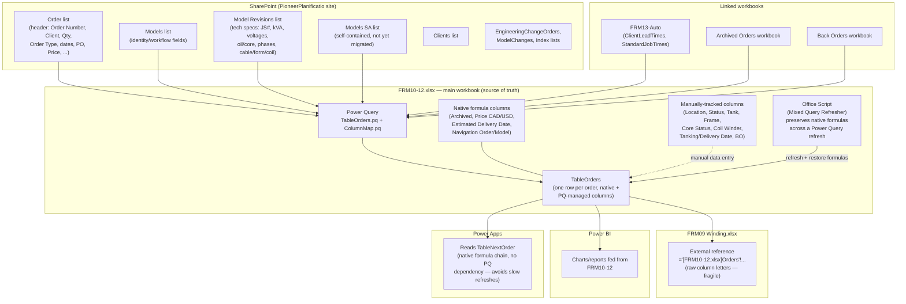

# Pioneer Transformer — Workflow & Data Infrastructure Overview

**Status:** living document. Started 2026-08-12 to capture the current state of the
Excel/SharePoint/Power Platform system before the next migration step (the **Order Items**
list, see [Planned: Order Items](#planned-order-items-list)). Update it as pieces move.

## Current state

Pioneer Transformer's planning/production data currently lives across two Excel workbooks
and a growing set of SharePoint lists, wired together with Power Query. Two things happen at
once during a "migration": data that used to live only as native Excel columns moves into a
SharePoint list, and Power Query is updated to pull it back into the workbook so existing
sheets/formulas keep working without staff having to change how they work day to day.

**Key characteristics of the current system:**

- **FRM10-12 is still the source of truth**, even for data that already has a SharePoint
  list — Power Query pulls SharePoint data *into* the workbook rather than the workbook
  reading live from SharePoint at use-time. A refresh is required to see SharePoint changes
  reflected in Excel.
- **Two kinds of non-Power-Query columns coexist on `TableOrders`**: native Excel formulas
  (computed, e.g. `Estimated Delivery Date`) and manually-typed production-tracking fields
  (Location, Status, Tank, Frame, Core Status, Coil Winder, Tanking/Delivery Date, BO). A
  plain "Refresh All" wipes the formula columns — only the dedicated Office Script preserves
  them. The manually-typed columns aren't touched by refresh but also aren't backed by
  anything outside the workbook, so they only exist wherever the workbook itself is.
- **`ColumnMap.pq`** is the single place that maps SharePoint field names/types onto the
  workbook's field names — new SharePoint-backed entities should be added there, not
  hardcoded into `TableOrders.pq`.
- **FRM09 depends on FRM10-12's `Orders` sheet by raw external-reference column letters**,
  which is why it breaks every time FRM10-12 inserts a column (see FRM09's own `CLAUDE.md`)
  — a structural fragility this infrastructure work should eventually design away from, not
  just patch each time.
- **Power Apps deliberately avoids the Power Query refresh dependency** for at least one flow
  (`TableNextOrder`) by reading a native-formula cell instead — a precedent worth reusing:
  anything that needs a fast, synchronous read probably shouldn't wait on a full workbook
  refresh.

## Planned: Order Items list

The next migration step is moving the **per-unit production layer** off `TableOrders`'s
native/manual columns and into its own SharePoint list. Today, `TableOrders.pq` expands each
`Order` row into one row per unit (via `Qty`), computing an identifier like `"21865-1/5"`
(order 21865, unit 1 of 5) — that expansion currently happens only inside Power Query, and
the production-tracking fields for each unit are typed directly into the live Excel file by
staff.

**Proposed shape (draft, not yet built or confirmed against live data):**

| Field | Source today | Notes |
|---|---|---|
| Order Item (e.g. `21865-1/5`) | Computed in `TableOrders.pq` | Would become the list's key/Title |
| Order Number | `Order` list (via merge) | Lookup to `Order` |
| Location | Manually typed in `TableOrders` | |
| Status | Manually typed in `TableOrders` | |
| Tank | Manually typed in `TableOrders` | |
| Frame | Manually typed in `TableOrders` | |
| Core Status | Manually typed in `TableOrders` | |
| Coil Winder | Manually typed in `TableOrders` | |
| Tanking Date | Manually typed in `TableOrders` | |
| Delivery Date | Manually typed in `TableOrders` | |
| BO (backorder flag) | Merged from `BackOrders` linked workbook | Could stay a lookup or become native |
| Archived | Native formula column | Decide: keep as native calc, or list-side status |

**Open questions to resolve before building this in SharePoint (not yet decided):**
1. Confirm the exact current column list/types directly against the live `FRM10-12.xlsx`
   `TableOrders` table (this draft is reconstructed from `TableOrders.pq` and prior session
   notes, not a fresh export).
2. One-to-many `Order` → `Order Items`, or does every field on this list also need its own
   merge key back to `Order`/`Models`/`Model Revisions` for the tech-spec fields the unit
   was built to?
3. Same differential-update pattern FRM10-12 uses for `Order`/`Models` (SharePoint is
   authoritative for new rows, existing live values win over a stale SharePoint pull) — or
   does the production-tracking data flow the other direction (Excel/Power Apps write to
   SharePoint, not just read)?
4. Where does this get *edited* day to day — directly in a SharePoint list view, through a
   Power App, or still in Excel with Power Query just mirroring it? This determines whether
   `ColumnMap.pq`'s existing pattern (SharePoint → Excel one-way) is even the right shape
   here, versus something bidirectional.

## Next steps
- [ ] Pull a fresh column export from live `FRM10-12.xlsx` `TableOrders` to replace the draft
      schema above with confirmed field names/types.
- [ ] Decide the open questions above with the user before creating the list in SharePoint.
- [ ] Once confirmed, add `Order Items` to `ColumnMap.pq`'s entity list and extend
      `TableOrders.pq` the same way `Model Revisions` was added.
- [ ] Revisit FRM09's raw-column-letter fragility (see FRM09's `CLAUDE.md`) as a candidate
      for the same structured-reference treatment once this list exists.
