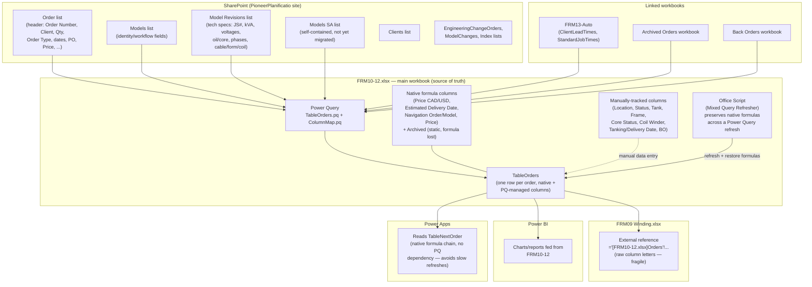
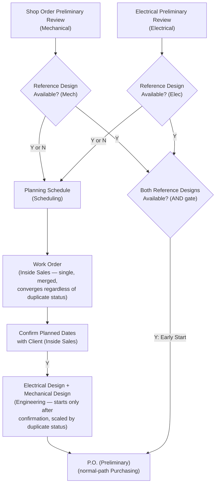

# Pioneer Transformer — Workflow & Data Infrastructure Overview

**Status:** living document. Started 2026-08-12 to capture the current state of the
Excel/SharePoint/Power Platform system before the next migration step: **retiring every
manually-typed and calculated column on `TableOrders`**, distributing each one to whichever
list actually owns that data (see [Planned: retiring FRM10-12's remaining
columns](#planned-retiring-frm10-12s-remaining-columns)). Update it as pieces move.

## Current state

Pioneer Transformer's planning/production data currently lives across two Excel workbooks
and a growing set of SharePoint lists, wired together with Power Query. Two things happen at
once during a "migration": data that used to live only as native Excel columns moves into a
SharePoint list, and Power Query is updated to pull it back into the workbook so existing
sheets/formulas keep working without staff having to change how they work day to day.

**Key characteristics of the current system:**

- **FRM10-12 is still the source of truth**, even for data that already has a SharePoint
  list — Power Query pulls SharePoint data *into* the workbook rather than the workbook
  reading live from SharePoint at use-time. A refresh is required to see SharePoint changes
  reflected in Excel.
- **Two kinds of non-Power-Query columns coexist on `TableOrders`**: native Excel formulas
  (computed, e.g. `Estimated Delivery Date`) and manually-typed production-tracking fields
  (Location, Status, Tank, Frame, Core Status, Coil Winder, Tanking/Delivery Date, BO). A
  plain "Refresh All" wipes the formula columns — only the dedicated Office Script preserves
  them. The manually-typed columns aren't touched by refresh but also aren't backed by
  anything outside the workbook, so they only exist wherever the workbook itself is.
- **`ColumnMap.pq`** is the single place that maps SharePoint field names/types onto the
  workbook's field names — new SharePoint-backed entities should be added there, not
  hardcoded into `TableOrders.pq`.
- **FRM09 depends on FRM10-12's `Orders` sheet by raw external-reference column letters**,
  which is why it breaks every time FRM10-12 inserts a column (see FRM09's own `CLAUDE.md`)
  — a structural fragility this infrastructure work should eventually design away from, not
  just patch each time.
- **Power Apps deliberately avoids the Power Query refresh dependency** for at least one flow
  (`TableNextOrder`) by reading a native-formula cell instead — a precedent worth reusing:
  anything that needs a fast, synchronous read probably shouldn't wait on a full workbook
  refresh.

## Business process workflow diagram

`workflow-data/Pioneer Transformers Model.vsdx` (Visio) — the "DESIGN ENG" page holds the
main swimlane flowchart: **Sales & Quotation → Engineering (Electrical/Mechanical) →
Purchasing & Scheduling → Production**. This complements the architecture diagram above —
that one shows the *data/technical* system (lists, queries, workbooks); this one shows the
*human business process* (who does what, in what order, with which tool). A backup copy
(`Pioneer Transformers Model.BACKUP.vsdx`) is kept alongside it before any edits, same
recovery pattern as `workbook/FRM10-12.xlsx` in FRM10-12.

**Applied 2026-08-12** (from `workflow-data/Diagram Edit.png` annotations + discussion —
additive changes via Visio COM, then refined further by the user directly in Visio):

1. **Add `Electrical Preliminary Review` + `Reference Design Available?`** in the
   Electrical Engineering lane, mirroring Mechanical's existing pair exactly. Purpose
   (confirmed by user): both Electrical and Mechanical need to independently assess whether
   an order is a repeat/duplicate build, to help Planning estimate the engineering work and
   set a realistic due date.
2. **New `Confirm Planned Dates with Client` step, in the Inside Sales lane** (not a new
   lane — this is Inside Sales' responsibility) — triggered automatically once `Work Order`
   finishes (updated 2026-08-21 — was `Planning Schedule`, see reorder note below), for
   *every* order, not conditional on duplicate status.
3. **Engineering always runs, for every order** — corrected 2026-08-12, the diagram's
   original `Y → Work Order 1` (skips engineering) / `N → Work Order 2` (full engineering)
   branching off Mechanical's `Reference Design Available?` was wrong and has been removed.
   Duplicate orders still need *minimal* engineering (e.g. name plates), not zero —
   engineering scales by duplicate status, it's never skipped. **User simplified this
   further while applying it**: merged the now-redundant `Work Order 1`/`Work Order 2` split
   into a single `Work Order` box, since every order needs one regardless of duplicate
   status once engineering is never skipped. **Reordered, confirmed 2026-08-21**: `Work
   Order` now sits *after* `Planning Schedule`, not before — Planning produces the planned
   date first, then Inside Sales (not Scheduling) creates the job scope `Work Order` from
   that date and confirms with the client. Reflected in the redone Visio project; see
   `phase1-plan.md`'s reorder section for the full rationale.
4. **Duplicate status's real effect: unlocks an early, parallel Purchasing/supplier-contact
   path** — not a full alternate route. Confirmed 2026-08-12: this early start requires
   **both** Electrical AND Mechanical to say `Reference Design Available? = Yes` (a
   "partial duplicate" — only one side — does not unlock it). Implemented as a `Both
   Reference Designs Available?` AND-gate feeding directly into `P.O. (Preliminary)`.
5. **`Confirm Planned Dates with Client` gates the actual start of Engineering** — user
   refinement beyond the original plan: rather than just notifying Sales in parallel,
   `Electrical Design` doesn't begin until this confirmation happens. Tightens "engineering
   always runs" into "engineering always runs, but only starts once the client has confirmed
   the planned date."
6. New **`Engineering Review Status`** field (schema-level, not a diagram shape) =
   `Full Duplicate` / `Partial Duplicate` / `New Design`, calculated from both departments'
   Yes/No answers. **Decided 2026-08-12**: start with this categorical status, not a
   numeric time estimate — a real time estimate needs a defined formula/lookup calibrated
   against real data that doesn't exist yet (same "start simple, revisit once there's usage
   data" pattern as `Trimestrial Customer` earlier). If a numeric estimate is wanted later,
   check whether FRM10-12's existing `StandardJobTimes` concept is the right home for it
   rather than inventing a parallel mechanism.

**Resulting logic** (see `docs/diagrams/design-eng-workflow-2026-08-12.png` for a rendered
snapshot right after the additive Visio-COM pass, before the user's further manual cleanup
**and before the 2026-08-21 `Planning Schedule`/`Work Order` reorder below — that snapshot is
now stale; re-export from Visio if a current static image is needed**):

**Reordered 2026-08-21** (confirmed, already applied in the redone Visio source): `Planning
Schedule` now comes before `Work Order`, and `Work Order` is an Inside Sales deliverable, not
Scheduling's. The mermaid below reflects the current, confirmed order.

**Goal (user-stated, 2026-08-12):** nothing should be manually typed into `FRM10-12.xlsx`
anymore, and calculated/native-formula columns should also live somewhere else if possible.
Every column that isn't already SharePoint-backed needs a home — but not all in one new
list. Each one goes wherever its data actually *belongs* conceptually (a specific unit, an
order, a model, a client), which may be the new **Order Items** list, an existing list
gaining a new column, or — for calculated columns — no stored-data home at all, just
recomputed wherever it's needed.

**Full column audit**, pulled directly from the staging copy's `TableOrders` table
(`xl/tables/table1.xml` + a sample data row in `xl/worksheets/sheet1.xml`) — 83 columns total,
confirmed live-adjacent data, not reconstructed from memory:

### Already SharePoint-backed (34 columns, no action needed)
- **Via `Order` list** (14): `Order` (computed unit ID, e.g. `21408-1/1`), Client, PO, Order
  Date, Lead Time (from `ClientLeadTimes`), Ing. Due Date (computed), Qty, PO Item # (merge
  key), Province/State, WET-WETP, Indexing, Initial Promised Date, BO (from `BackOrders`
  linked workbook), Price Value.
- **Via `Models`/`Model Revisions`** (20): KVA and KV, Primary Voltage, Secondary Voltage,
  Phases, JS #, Description, Type, Info+, Protector & Switchgear Item #, Technical Notes,
  Core, Oil Type, **Oil Amount**, Configuration, Section Qty, Cable, Form, Copper (LV), Wire
  (HV), Overcoil.

### Native Excel calculated columns (7) — not data, don't need a "home" so much as a new place to *compute*
`Price`, `Estimated Delivery Date`, `Price CAD`, `Price USD`, `Navigation Order`,
`Navigation Model`, `Archived`. **Full analysis done, 2026-08-18 — see
`calculated-columns-plan.md`** for the exact formula text and per-column destination
(pulled directly from the workbook, not guessed). Short version: none of the 7 can be a
plain SharePoint calculated column (cross-list lookups and `TODAY()`/Hyperlink output are
both hard-blocked there) — `Price`/`Navigation Order`/`Navigation Model` should be dropped
(redundant with SharePoint's native Lookup-column navigation), `Estimated Delivery
Date`/`Price CAD`/`Price USD` need a Power Automate flow instead, and **`Archived` turned
out to have no live formula at all** — it's a flattened static `"Exists"`/blank marker
whose values don't correlate with today's delivered/cancelled criteria, needing a drop/keep
decision rather than a port.

### Remaining 42 manually-typed columns — proposed destination (⚠ = needs your confirmation, not a domain call I can make from the data alone)

**→ New `Order Items` list** (varies per physical unit, confident these are unit-level):
Location, Status, Core Status, Production Line, Time (days), Tank, Tank Delivery Date,
Frame, ISO Stack, ISO Coil, Lead Assembly, Coiling Date, Stacking Date, Assembly Date,
Drying Date, Tanking Date, Testing Date, Finishing Date, Delivery Date, Original Tanking
Date, Tanking date change justification, Manual Estimated Delivery Date, Witness/Other,
Temperature Rise, Impulse, Partial D, Oil Analysis, **Protector Status** (confirmed
2026-08-12: per-unit, not per-order), **DB, SFRA, CSA** (confirmed 2026-08-12: per-unit test
results, same list as the other tests — not a separate list).

**`Trimestrial Customer`** — also goes on `Order Items`, per-unit, but flagged 2026-08-12 as
a deliberately provisional placement, not a confirmed fact about the data's real grain: it's
NOT a per-client attribute despite the name (same client can show different statuses across
their orders), but whether it truly needs to vary *within* a single multi-unit order (unit
1 different from unit 2 of the same order) vs. just order-to-order is still unconfirmed.
**User's call: start per-unit, revisit once there's enough real usage data to run a
proper table/workflow-optimization analysis** — if that analysis shows it's actually
order-level, descope it down to the `Order` list then rather than guessing now.
(**Separately, 2026-08-13**: a full-history data check found this field likely isn't even a
yes/no attribute at all — see the schema table below, "Trimestrial Customer" row, for the
`Pénalité Trimestrielle` finding. Pending clarification from business users, unrelated to
the placement question above.)

`Winder` and `Coil Winder` also both belong here, per-unit — confirmed 2026-08-12 they're
genuinely two different things, not a duplicate: `Winder` is the *set of possible* winders a
given unit could be produced on (an eligibility/capacity constraint), and `Coil Winder` is
the *specific* winder actually chosen for that unit. **Both should stay manually-filled
fields on Order Items, not computed/automated** — user feedback from staff is that they
prefer entering this by hand rather than having it derived, so keep it a plain editable
field in the new list, same as it is today, just off `TableOrders`.

**→ Existing `Order` list, as new columns** (one value per Order Number, not per unit —
sales/engineering-process fields, matching the workflow booleans `Order` already has like
"Receive CRM Sales Order"): Engineering Required, LDs, Client Date Status, Sales Notes.
Plus **`Order Status`** (Choice: Active/Cancelled — new, decided 2026-08-12, see
[completion/cancellation/archiving
logic](#planned-completion-cancellation-and-archiving-logic) below).

`Protector & Switchgear PO` was originally listed here too, but **reclassified to
`Order Items` instead — user's call, 2026-08-13**: it's a per-transformer purchasing
column (each unit's protector/switchgear can be a separate PO), not per-order — pairs with
`Protector Status`, which is per-unit for the same reason (see the Test/QA results table
below).

**`Order Entry Status` redesign — proposed 2026-08-12, NOT yet confirmed.** The existing
`Order Entry Status` (In Progress/Done) only ever reflects whichever `Order Step` stage is
current — it gets reused/reset every time `Order Step` advances, so it can't answer "when
did Engineering Preliminary Review actually finish" once the order has moved on to
Electrical Design. **Proposal**: replace it with one Date+Status pair per `Order Step`
stage, same pattern as the production-sequence dates on Order Items above — e.g.
`Engineering Preliminary Review Date` + `Engineering Preliminary Review Status`
(Pending/In Progress/Completed). This is my extrapolation from the user's "mixup" comment,
not something explicitly requested at this scope — **needs confirmation**: does this apply
to all 14 `Order Step` values, only some, or is a full per-stage history overkill here
compared to Order Items (where it directly maps to physical `Location` stages)?

**→ Existing `Model Revisions`, as new columns** (decided 2026-08-12: `Model Revisions`
specifically, not `Models` — both fields below can change revision-to-revision, not just
model-to-model):
- `Duplicate Order` — confirmed 2026-08-12 by user: it's "the last
  order that was produced/designed of that model," i.e. a pointer to the most recent Order
  Number built against this model/revision, not an order-administrative field. Implemented
  as a native Lookup → `Order` (`Order Number` field) — confirmed 2026-08-12 that despite no
  custom Lookup fields showing up in the flattened CSV schema exports, native Lookups ARE
  used elsewhere in this system already; the CSV export process just flattens them to text.
- `Duplicate` itself (the old Y/N "this design needs minimal new engineering" flag) is **not
  migrated as-is** — confirmed 2026-08-12: it's an old classification being superseded by the
  **engineering modification tracker** (the existing `EngineeringChangeOrders`/`ModelChanges`
  SharePoint lists) — whatever the new list-based workflow needs from "was this a duplicate
  build" should be derived from that tracker going forward, not carried over as its own field.
- `Family` — confirmed 2026-08-12: model revision-level (see placement decision above), and **is** the same concept as the
  `Production Complexity` validation list (`A`, `B1`, `B2`, `C`) — the field name stays
  `Family` (client's preferred term) even though it's really a complexity rating; revisit
  the name only if the client's preference changes later, don't rename unprompted. Choice
  field, values: `A`, `B1`, `B2`, `C`.

### Open questions on mechanics (separate from *which* column goes *where*)
1. ~~Edit surface / sync direction~~ — **resolved 2026-08-12**: staff will edit `Order Items`
   rows directly in a SharePoint list view, same as `Order`/`Models` today. SharePoint is the
   source of truth for this data; Power Query stays one-way (SharePoint → Excel), same
   differential-update pattern `ColumnMap.pq`/`TableOrders.pq` already use — **no
   bidirectional write-back mechanism needed**, this fits the existing pattern exactly.
2. Calculated columns (`Price`, `Estimated Delivery Date`, `Price CAD/USD`,
   `Archived`) — **decided 2026-08-12: parallel-run, then cut over.** Keep these as native
   Excel formulas on `TableOrders` for now (still reading from what are now SharePoint-backed
   lookup columns). In parallel, try building the same logic as SharePoint calculated
   columns (on `Order`/`Order Items`, once their inputs live there). Only remove the Excel
   formulas once SharePoint's version is confirmed to reproduce every one of them correctly —
   don't cut over on a single field passing, validate the whole set first. If SharePoint's
   formula language can't express one (e.g. the currency-conversion `XLOOKUP` against
   `Table_USD_CAD_Conversion_Rate` behind Price CAD/USD, or multi-step `IF` chains like
   `Estimated Delivery Date`), that one likely needs a Power Automate flow instead — decide
   per-column once the parallel-run surfaces which ones SharePoint genuinely can't handle.

## Order Items list schema (draft v1)

Types below are inferred from the sample row pulled during the column audit (a single row
isn't enough to be certain, especially for anything currently blank) — flagged with ⚠ where
the type is a real guess, not just a formality. Not yet built in SharePoint.

**Identity / merge key:**

| Field | Type | Notes |
|---|---|---|
| Title (displayed as **`Unit ID`**) | Text | **Confirmed live 2026-08-13**: user renamed the display name from `Title` to `Unit ID` for clarity — reference it as `Unit ID` in Power Query/Power Automate going forward (SharePoint.Tables reads by display name, not the underlying internal name). Set to the unit identifier, e.g. `21408-1/1` — same value `TableOrders.pq` already computes as its `Order` column, so this doubles as the natural join key for the eventual Power Query merge (same pattern `ArchivedOrders`/`BackOrders` already use, keyed on `Order`). |
| Order Number | Lookup → `Order` list | The merge key back to the order header, e.g. `21408`. Confirmed 2026-08-12: a native SharePoint Lookup column (`ShowField` = `Order`'s own `Order Number` text field, not `Title` — `Order`'s `Title` field holds something else). |
| Unit # | Number | The numerator in the unit identifier (`1` in `21408-1/1`) — stored explicitly rather than parsed out of Title every time it's needed. |
| Qty | Number | The denominator (`1` in `21408-1/1`) — for convenience/sanity-checking only; `Order` list's `Qty` stays authoritative. |
| SA Job | Yes/No | **Real meaning confirmed 2026-08-13** (matches `TableOrders.pq`'s existing computed boolean, but that alone didn't explain what it *means*): some transformers ship with an auxiliary unit needing its own independent production tracking despite conceptually being "the same order item" — it gets its own `Order Items` row, `Title` = parent unit ID + ` SA` suffix (e.g. `21408-1/1` / `21408-1/1 SA`), `Unit #`/`Qty` copied from the parent. `SA Job = Yes` marks that row as the auxiliary, not an abstract property. Not counted as a separately priced/reported unit — Power BI today filters SA rows out of reporting, keeping only the main version; relevant when `Price` and other calculated columns/reports get built against this list. Most important spec fields for an SA unit's own construction: `Cable`, `Form`, `Copper (LV)`, `Wire (HV)`, `Overcoil` (already on `Models`/`Model Revisions`). |

**Cross-reference lookups (added 2026-08-13, ⚠ blocked on the Models SA fusion):**

| Field | Type | Notes |
|---|---|---|
| Client | Lookup → `Clients`/`Models`/`Models SA` (source TBD) | **Decided 2026-08-13**: duplicate `Client`/`Model`/`Model Revision` directly onto `Order Items` rather than relying on the cascade through `Order` — SharePoint can't join through a Lookup in views/filters/reports, and this exact workaround is already used on `Model Revisions`' own `Client` Lookup. For a normal unit these mirror the parent `Order`'s value; for an SA auxiliary row (`SA Job = Yes`) they point at the SA-specific model/revision instead, which also resolves the older "SA row has nowhere to point at its own model" gap. |
| Model | Lookup → `Models` | Same rationale as `Client` above. |
| Model Revision | Lookup → `Model Revisions` | Same rationale as `Client` above. |

**Blocked, not just deferred**: a Lookup column can only target one list, so these can't be
built until `Models SA` is fused into `Models`/`Model Revisions` ([[models-sa-fusion-plan]])
— otherwise an SA row's `Model` lookup would need a different target list than a normal
row's `Model` lookup, which one column can't do. Full detail:
`order-items-manual-build-checklist.md`'s step 8.

**Sync note**: these are one-time stamps at row-creation (backfill/transfer flow, later the
`Work Order` fan-out), not continuously synced from `Order` — user's call, sync risk judged
low since these values essentially never change post-creation. A "parent changed → update
children" flow is logged as a future nice-to-have in `roadmap.md` if that assumption ever
proves wrong.

**Test/QA results** (⚠ currently stored as a text marker — `'x'` for done/pass, blank otherwise; proposing Yes/No instead, which is a real type change worth confirming, not just a formality):

| Field | Type |
|---|---|
| Witness/Other | Text |
| Temperature Rise | Yes/No (confirmed 2026-08-12) |
| Impulse | Yes/No (confirmed 2026-08-12) |
| Partial D | Yes/No (confirmed 2026-08-12) |
| Oil Analysis | Yes/No (confirmed 2026-08-12) |
| DB | Yes/No (confirmed 2026-08-12) |
| SFRA | Yes/No (confirmed 2026-08-12) |
| CSA | Yes/No (confirmed 2026-08-12) |
| Protector Status | Choice: Entrepôt SN, Reçu, à vérifier (real values found 2026-08-12, from `TableValidationProtectorStatus` on the workbook's `List` sheet) |
| Protector & Switchgear PO | Text — moved here from `Order` (2026-08-13): per-transformer purchasing, not per-order |

**Production tracking:**

| Field | Type | Notes |
|---|---|---|
| Location | Choice: Isolation, Bobinage, Stacking, Assemblage, Four, Tanking, Test, Finition, Livraison, Entrepôt, Extérieur, Réparation | Confirmed 2026-08-12 from `TableValidationLocationCodes`. **Purely the physical production stage now** — `AN` (Annulée/cancelled) is deliberately dropped from this list, moved to the new `Item Status` field below (2026-08-12 design decision: don't overload "where is it" with "what happened to it"). **Stored value decided 2026-08-12: full descriptive names, not the short codes** (`IS`/`BO`/etc.) — readability for staff in the list view won out over matching the old raw codes; the Delivered-trigger logic below is written against the full name accordingly. |
| Item Status | Choice: Active, Delivered, Cancelled, Regrouped | **New field, added 2026-08-12.** Carries the lifecycle state that used to be smuggled into `Location` (`AN`) or inferred from `Location`+`Delivery Date` (the old completion heuristic). Defaults to `Active`; flips to `Delivered`/`Cancelled`/`Regrouped` as those events happen. See [completion/cancellation/archiving](#planned-completion-cancellation-and-archiving-logic) below for how each state gets set. |
| Regrouped Into | Lookup → `Order Items` (multi-value), self-referencing | **New field, added 2026-08-12.** Only populated when `Item Status = Regrouped` — points at the resulting item(s) in this same list, so "what did order X's units turn into" stays queryable instead of living in a free-text note. |
| Status | Text | Confirmed 2026-08-12: this is a **composite** value — a validated Prefix (Attente/AT, En cours/EC, Réparation/RE, Manque Pièces/BO, Terminé/TE, Bobine 1/B1, Bobine 2/B2, Bobine 3/B3, from `TableValidationStatusCode`) concatenated with a month-year suffix (sample: `TE-Jui-16`). Kept as plain Text for now rather than guessing how to split it — worth deciding later whether this becomes two fields (a Choice for the prefix + a separate date) or stays one text value. |
| Core Status | Choice: Entrepôt SN, Reçu, Transport | Confirmed 2026-08-12 from `TableValidationCoreStatus`. |
| Production Line | Choice: Power / Ligne 1, Distribution, Power, Zone B, Ligne 1 | Confirmed 2026-08-12 from `TableValidationProductionLine`. |
| Time (days) | Number | |
| Tank | **Yes/No** (corrected 2026-08-17 — see note) | Originally planned 2026-08-12 as Text (`R` = "Received," deliberately manually-filled, not Choice). **Found built live as Yes/No instead**, discovered while building the transfer flow (`order-items-power-automate-flows.md` step 3) — kept as Yes/No rather than reverted, but recorded here since it contradicts this doc's original decision. |
| Frame | Choice: Plaspak, Reçu, 0 | **Re-verified 2026-08-12 directly against `Table20` (`List` sheet, range `Y8:Y11`)**: the real validation list has all 3 values, not 2 — an earlier pass on this doc dropped the literal `0` entry. Meaning of `0` as a choice (vs. blank) is unconfirmed — likely a "none/not applicable" placeholder — but it's a real, present option in the source table, not a data-entry error, so it belongs in the Choice list as-is. |
| ISO Stack | **Yes/No** (corrected 2026-08-17) | Same correction as `Tank` above. |
| ISO Coil | **Yes/No** (corrected 2026-08-17) | Same correction as `Tank` above. |
| Lead Assembly | **Yes/No** (corrected 2026-08-17) | Same correction as `Tank` above. |
| Winder | Text | Must stay Text (not Number) — values mix plain IDs and ranges (`100-104`) in the sample. Per user, stays manually-filled, not derived. |
| Coil Winder | Text | Same as `Winder` — kept Text even though the sample looked numeric, for consistency and to avoid a type mismatch if another row uses a non-numeric ID. Manually-filled. |
| Trimestrial Customer | Text (staying Text, not Choice — decided 2026-08-13) | **Full-history check (2026-08-13) across ~1018 `TableOrders` rows found it's NOT a simple Yes/No**: 160 rows hold literal text `N` (never `Y`, anywhere), 2 rows hold what look like real Excel dates (serials `46452`/`46295`, ≈ Feb 2027 / Sept 2026), rest blank. A formula-glitch artifact also revealed the column's real French label: **`Pénalité Trimestrielle`** ("Trimestrial **Penalty**," not "Trimestrial Customer" as a classification) — suggesting this may actually track *when* a quarterly penalty applies, not a yes/no customer attribute. **Pending clarification from the business users who actually know this field, once they're back from holidays** — don't build a Choice/Yes-No list off any guess until then; stays a plain Text field so no data shape is assumed prematurely. Per-unit placement question (see above) is still separately open too. |

**Dates:**

**Production-sequence dates — redesigned 2026-08-12, expanded to Start/End 2026-08-13.**
The sample data only showed real dates, but the user confirmed these 8 fields can actually
hold either a real date OR in-progress text today — something SharePoint's Date type can't
represent. They line up exactly with the `Location` stages (Bobinage→Stacking→Assemblage→
...→Test→Finition→Livraison), i.e. they're the *history* of when a unit passed through each
stage that `Location` only shows the *current* one for. **Each one is now a triple**: a
`Status` Choice field (`Pending`, `In Progress`, `Completed` — blank means "not relevant
yet," before the step is next in line), a `Start Date` field that gets stamped when `Status`
first becomes `In Progress`, and an `End Date` field that gets stamped once `Status =
Completed`. The `Start Date` addition (2026-08-13) is for real time-*spent* tracking, not
just completion timestamps — inferring a start time from the previous stage's finish time
instead would wrongly count idle/waiting time as work time. The original `{Stage} Date`
field was renamed to `{Stage} End Date` for symmetry with the new `Start Date` field — same
field, new name, not a new column.

| Start Date field (NEW) | End Date field (renamed from `{Stage} Date`) | Status field |
|---|---|---|
| Coiling Start Date | Coiling End Date | Coiling Status |
| Stacking Start Date | Stacking End Date | Stacking Status |
| Assembly Start Date | Assembly End Date | Assembly Status |
| Drying Start Date | Drying End Date | Drying Status |
| Tanking Start Date | Tanking End Date | Tanking Status |
| Testing Start Date | Testing End Date | Testing Status |
| Finishing Start Date | Finishing End Date | Finishing Status |
| Delivery Start Date | Delivery End Date | Delivery Status |

**Fixed 2026-08-13**: the `Delivery Data` typo is resolved — user deleted and recreated
the column as `Delivery Date` (zero data-loss risk since `Order Items` was still empty),
which also gives it a clean matching internal name instead of a permanent
`DeliveryData`/`Delivery Date` mismatch. It was then folded into the Start/End expansion
above as `Delivery End Date`.

Confirmed live 2026-08-13 (fresh `Order Items` export): all 16 Start/End fields are **Date
and Time** (not Date-only) — useful later for finer-grained production-time analytics (e.g.
actual duration between stages, not just which day).

All three fields per triple: `Start Date`/`End Date` = Date+Time, `Status` = Choice
(Pending/In Progress/Completed). `Item Status = Delivered` still triggers off `Delivery End
Date` populated (i.e. `Delivery Status = Completed`) AND `Location = Livraison` —
unaffected by this expansion, just now sourced from `Delivery Status`/`Delivery End Date`
instead of the old single `Delivery Date` field.

**Other dates — stay plain Date fields, NOT split** (confirmed 2026-08-12: a different
category — vendor/audit/override dates, not steps in the production sequence):

| Field | Type |
|---|---|
| Tank Delivery Date | Date |
| Original Tanking Date | Date |
| Manual Estimated Delivery Date | Date |
| Tanking date change justification | Multi-line text (Note) — sample value was a long `/`-delimited log of past change reasons. |
| Planned Tanking Date | Date |
| Planned Delivery Date | Date |

*(One validation list found on the `List` sheet, `TableValidationTankingDateStatus`
(Planned/Confirmed/Realised), doesn't correspond to any current `TableOrders` column —
confirmed 2026-08-12 by user as dead/unused, not carried into this schema.)*

**`Planned Tanking Date`/`Planned Delivery Date` added 2026-08-21**: found while running the
backfill that raw `TableOrders`' `Tanking Date`/`Delivery Date` columns are planning/estimate
dates (what production and procurement plan a due date around), not actual completion
timestamps — they were wrongly headed into the automated `Tanking End Date`/`Delivery End
Date` fields above, fabricating a `Completed` status. See `order-items-power-automate-flows.md`'s
Step 3 for the corrected mapping and the remediation pass needed for rows already backfilled
under the old (wrong) mapping. Not a duplicate of `Original Tanking Date`/`Manual Estimated
Delivery Date` above — those come from separate raw Excel columns, already correctly mapped.

## Planned: completion, cancellation, and archiving logic

Noted 2026-08-12 by user, not yet built — logged here so it isn't lost before the "complete
task workflow" project formalizes it.

**Design decision (2026-08-12): don't overload `Location` with lifecycle events.** The old
Excel workflow packed cancellation (`AN`) and — historically — regrouping (`GR`, added ~1
year ago, since untraceable even by the user: *"I am not sure where the GR went"*) into the
same `Location` dropdown that otherwise describes physical production stages (Isolation,
Bobinage, Tanking, ...). That mixing is exactly why `GR` became unrecoverable — a lifecycle
event living inside a "where is it physically" field has no home of its own to audit. Fixed
in the new schema by splitting into two fields on `Order Items` (see schema table above):
- **`Location`** — physical production stage only (12 values, `AN` removed).
- **`Item Status`** — the lifecycle state: `Active` (default), `Delivered`, `Cancelled`,
  `Regrouped`.

**How each `Item Status` value gets set:**
- **`Delivered`**: replaces the old two-field heuristic with a single authoritative value,
  but **keeps checking both original conditions** — corrected 2026-08-12, this is *not*
  just "Delivery Date populated." **Decided: automatic, not manual** — a SharePoint
  calculated column (or a small Power Automate flow, if the calculated-column language
  can't express it) sets `Item Status = Delivered` whenever `Delivery Date` is populated
  **AND** `Location = Livraison` (updated 2026-08-12 to the full name, not the old `LI` code
  — see the Location field note above). Two manual entries (the date + the location) still
  drive it, just collapsed into one authoritative field instead of forcing every consumer to
  re-derive the same two-condition check themselves.
- **`Cancelled`**: manual, replaces the old `AN` `Location` value.
- **`Regrouped`**: manual, replaces the old `GR` `Location` value. Paired with a new
  **`Regrouped Into`** field — **decided 2026-08-12**: a (multi-value) Lookup column on
  `Order Items` pointing at the resulting row(s) in the same list, not free text. Queryable
  ("what did order X's units turn into") since it's a real reference, not a string — the
  tradeoff is the new item(s) need to already exist in `Order Items` before you can fill
  this in on the old one, so regrouping becomes a two-step action (create the new item(s),
  then point the old one(s) at them), not a single field edit.
- **`Active`**: default, everything still in normal production flow.

**Cancellation/completion logic reuses `Location = Livraison`**, not the old `AN`/`LI` short
codes — see the updated `Location` field note above (2026-08-12: stored as full descriptive
names in the actual list, decided while writing the manual build checklist).

**Order-level cancellation — decided 2026-08-12**: a whole `Order` can be cancelled even
before any of its units individually are (or after some already shipped), so it needs its
own status, not just derived from its `Order Items`. New **`Order Status`** field on the
`Order` list: Choice, `Active`/`Cancelled` — same pattern as `Item Status`, kept as a
separate field rather than inferring cancellation from "are all units Cancelled" (that
derivation can't represent cancelling an order before any units exist).

**Still open:**
- **Archiving for Power BI historical analysis**: orders need an archiving mechanism that
  keeps them usable for historical reporting once removed from the live working set. User is
  considering switching the existing archive Power Query (`ArchivedOrders`/the "Archived
  Orders workbook" in the current-state diagram above) to pull from SharePoint instead of
  FRM10-12 — consistent with the rest of this migration's direction (SharePoint as the
  source, Excel/Power BI as consumers).

## List relationship graph — read before designing any cross-list sync (mapped 2026-09-05)

Every lookup below was read from `_api/…/fields` (`LookupList` + `LookupField`), not inferred from
column names.

| From | Lookup column | → Points at | Matches on |
|---|---|---|---|
| **Order Items** | `Order Number` | Order | `Order_x0020_Number1` |
| **Order Items** | `Client` | Clients | `Title` |
| **Order Items** | `Model` | Models | `ModelName` |
| **Order Items** | `Model Revision` | Model Revisions | `ModelID` |
| **Order Items** | `Regrouped Into` *(multi)* | Order Items *(self)* | `Title` |
| Order | `Client` | Clients | `Title` |
| Order | `Model` | Models | `ModelName` |
| Order | `Model:kVA and kV` | Models | `kVA_x0020_and_x0020_kV` — **projected field, create-time only** |
| Order | `Model Revision` | Model Revisions | `ModelID` |
| Models | `Client` | Clients | `Title` |
| Models | `Latest Model Revision` | Model Revisions | `ModelID` |
| Models | `Parent Model` | Models *(self)* | `ModelName` — SA model → its main model |
| Model Revisions | `Client` | Clients | `Title` |
| Model Revisions | `Pioneer Model Code` | Models | `ModelID` |
| Model Revisions | `Duplicate Order` | Order | `Order_x0020_Number1` |

### The headline: every parent is ONE hop from `Order Items`

`Order Items` already carries **direct** lookups to all four parents. The conceptual chain
(`Clients` → `Models` → `Model Revisions` → `Order` → `Order Items`) is real, **but nothing has to
walk it** — every sync is a single-step read. That makes the centralisation work substantially
cheaper than the chain suggests.

### Fan-out — what one parent edit costs (measured, 1,019 unit rows)

| Parent | Distinct | Avg units | Worst case | Verdict |
|---|---|---|---|---|
| Order | 330 | 3.1 | 29 (`22106`) | **Safe** |
| Models | 147 | 6.9 | 91 (`1002113-22`) | OK **with a change-guard** |
| Model Revisions | 391 | ~2.6 | not measured | OK **with a change-guard** |
| **Clients** | 37 | 27.5 | **698 — HYDRO QUEBEC is 68% of the list** | **`Lead Time` only, after X3** |

### Three traps

1. **Sync `Clients.Lead Time` and nothing else — and only after X3.** ⚠️ *Revised 2026-09-05; this
   trap previously read "do not sync the Clients list" and that was too broad.* One edit to the
   HYDRO QUEBEC row does fan out to **698** `Order Items` updates plus a trigger-flow run each. But
   that 698 was measured against the **current 100-action trigger flow**: once X3 strips the
   stage-stamping it is ~5 actions and 698 runs drains in minutes. A client's lead time also changes
   only a few times a year, so the burst is rare — and when it fires it is doing the work you want.

   What still holds is *which* columns travel. The name columns stay off: `Clients` has only two
   real columns (`Title`, `Client_ID`), `Order Items` already resolves the name through its own
   `Client` lookup, and `Client_ID_TextField` already exists there and needs a one-time backfill
   rather than a sync. What is new is the FRM13 `LeedTime` data landing on `Clients` (see
   [[CLAUDE.md]] → FRM13): **`Lead Time` travels** because branch 7 of Estimated Delivery needs it
   local to `Order Items`; **`Pièce critique` / `Fournisseur` do not** — they are reference, one
   lookup away, and duplicating them onto 1,052 rows buys nothing.

   Why syncing it is a *correction* rather than a risk: `Order.Lead Time` values layer by date, not
   by order-specific decision. HYDRO QUEBEC's 240 orders split `26` (144, 2024-02 → 2026-04), `20`
   (84, of which 82 are 2026) and `28` (12, all 2026-08) — each a snapshot of what the number was
   thought to be at order entry, never backfilled. FRM13's current 28 only appears from this August.
   So the sync corrects 228 of 240 rather than flattening overrides. **One check first:** the 82 HQ
   orders at `20` in 2026 — if any was a faster date actually promised to a customer, the sync
   rewrites it.
2. **The SA trap — `Order.Model` is not `Order Items.Model`.** For SA units, `Order Items.Model`
   deliberately points at the **SA twin** (resolved via `Models.Parent Model`) while `Order.Model`
   points at the main model. That difference was built on purpose and caught in testing 2026-09-01.
   **Measured 2026-09-05:** of the 34 orders holding both an SA and a non-SA unit with a model on
   each, **32 carry a different model on the SA unit**; 2 match. Model Revision splits identically.
   Zero orders have non-SA siblings that disagree — so "all items of an order share a model" is
   exactly right for the normal units and exactly wrong for the SA ones.

   The decision (2026-09-05) is that a model corrected on the `Order` **must** propagate, so the
   sync does not skip SA units — it **re-resolves** them: for `SA Job` false write `Order.Model`
   straight through; for `SA Job` true write the `Models` row where `SA Model` is true and
   `Parent Model` equals the new model's `Model_Code`. That link is sound — it resolves on **15 of
   15** SA models. Two limits: only **15 of 390** models have a twin at all, so an order moving to
   any of the other 375 must stop and flag for engineering rather than write a wrong model or a
   blank; and **5 of the 42 SA units already sit on plain `M-` models** rather than `MSA-` (order
   `22110` runs `M-HYQU-0094` against an SA unit on `M-GEPO-0013`, a different client's design), so
   those have no twin to re-resolve to and need review first.
3. **`Models` ↔ `Model Revisions` is a cycle** — `Models.Latest Model Revision` → Model Revisions,
   and `Model Revisions.Pioneer Model Code` → Models. Neither writes to the other today so nothing
   loops, but a future sync writing back up the chain is where an infinite loop would start.
   Change-guards on every write are what keep it safe.

**Picker workbook:** `sharepoint-lists/Order Items parent column picker 2026-09-05.xlsx` — 117
candidate columns across the four lists, with a `Relationships` sheet carrying the table above.

## Process/progress status — the third axis (decided 2026-09-05)

**Extends the 2026-08-12 `Location` / `Item Status` split above, using the same principle:
*don't overload "where is it" with "what happened to it"* — and now, nor with *"how far along
is it"*.**

Once the Phase 1 workflow exists, process status should be **automatically maintained from a unit's
total progress** rather than hand-typed. The question raised was whether that belongs in
`Item Status`, replacing the generic `Active`.

**Decision: no. It gets its own column.** There are three orthogonal questions and each needs one:

| Question | Column | Values |
|---|---|---|
| Where is the transformer physically? | `Location` | Isolation, Bobinage, … Extérieur (12) |
| Does this row still count? | `Item Status` | Active / Delivered / Cancelled / Regrouped |
| **How far through the process is it?** | **`Current Step`** *(new, not yet built)* | the workflow steps |

### Why `Item Status` must not absorb it

**`Active` is load-bearing as a filter, not just a label.** Verified 2026-09-05 across the repo —
the Production Floor view, Planning, BO Tracking, the demo cheat sheet's troubleshooting step, the
reconciliation pass and the archiving sweep **all** filter on `Item Status = Active`
(`cutover-runbook-2026-09-01.md:394,447` · `cutover-plan-2026-09-02.md:220` ·
`demo-cheat-sheet-2026-09-01.md:147` · `archiving-plan.md:42,72`).

Replacing `Active` with step values makes **every one of those filters silently match nothing** —
no error, just empty views. It also destroys the one-predicate "is this row live?" test, which
would become `Item Status NOT IN (Delivered, Cancelled, Regrouped)` — poorly supported in
SharePoint view filters.

### Naming — three different things are currently called "Status"

`Status` (the composite), `Item Status` (lifecycle), and 8 × `{Stage} Status`. That collision is
the real source of confusion. **Display names can be changed safely — view filters and flow
expressions bind to the *internal* name**, so renaming the label is low-risk:

| Internal name (unchanged) | Today | Proposed display |
|---|---|---|
| `ItemStatus` | Item Status | **`Lifecycle`** |
| `Location` | Location | `Location` — keep, accurate and familiar to staff |
| `Status` | Status | **`Step Status`** + a new `Status Date` (see below) |
| *(new)* | — | **`Current Step`** |
| `{Stage}Status` | Coiling Status, … | keep — per-stage detail |

### Order-scoped vs item-scoped steps

`phase1-plan.md`'s `Workflow Tasks` chain is deliberately **mixed-scope**: order-level `Order Entry`
→ parallel Electrical/Shop reviews → AND-gate → **fan-out to per-unit** Planning Schedule → Work
Order → **converge back to order-level** Confirm Planned Dates.

So a single per-unit column cannot represent it. **The split, which rides on the
parent→`Order Items` sync:**

- **Order-level step** lives on `Order`, syncs down as **`Order - Current Step`**.
- **Unit-level step** lives on `Order Items` as **`Current Step`**.
- **Overall position** = whichever is further along — a calculated column, viable *because* the sync
  makes both values local. The cross-list dependency becomes a local comparison.

### Sequencing and open items

**Do not build yet.** Depends on the `Workflow Tasks` list (Phase 1, not started) and the parent
sync. The shape is decided now so that `Item Status` isn't overloaded in the meantime — that would
be expensive to unpick.

**Open — check before inventing a new vocabulary:** FRM10-12's `List` sheet (cols 25–27) already
carries a **"Statut PIONEER"** table — `Envoyé à l'assemblage`, `Pièces B.O.`, `Problèmes`,
`Fini prêt à livrer`, `Livrée`, `Entreposé Morin`, `Reçu Pioneer`, codes `EC`/`BP`/`PP`, plus an
`FP`/`LP` list at col 29. **This may already be the process status wanted**, with the advantage that
staff use it today.

### Related: the composite `Status` column should be split

`Status` holds values like `TE-Se-4`. Code table confirmed 2026-09-05 in FRM10-12's `List` sheet
(cols 13–15): `AT` Attente · `EC` En cours · `RE` Réparation · `BO` Manque Pièces · **`TE` Terminé**
· `B1`/`B2`/`B3` Bobine 1/2/3.

**The status is relative to the *current* step, not absolute** — `TE-Se-4` on a unit at
`Location = Bobinage` means "Bobinage finished as of Sept 4". Measured 2026-09-05: 156 of 1019 rows
populated, 16 distinct values, all shape `PREFIX-Month-Day`.

Three defects that splitting into **`Step Status`** (Choice) + **`Status Date`** (Date Only) fixes:

1. **No year** — on a list holding dates out to 2029.
2. **Ambiguous French months** — `Jui` is Juin *or* Juillet; `Ma` would be Mars *or* Mai. **9 live
   rows carry `Jui`** and cannot be resolved without asking staff.
3. **Sorts as text** — `TE-Ao-11` before `TE-Se-4`, which is meaningless.

It also loses *which step* the status applied to (that's in `Location`, which moves on), so
historical status is unrecoverable once a unit advances — consider a `Status Step` column too.

⚠️ **Code collision — the same two letters mean different things per column:**

| Code | As `Location` | As `Status` |
|---|---|---|
| `TE` | Test (stage) | **Terminé** (finished) |
| `BO` | Bobinage (winding) | **Manque Pièces** (missing parts) |
| `RE` | Réparation | Réparation — the only one that agrees |

Anything parsing these must know which column it is reading. Worth stating in the staff guide.

## Next steps
- [ ] Confirm the draft schema above (especially the ⚠-flagged type changes) with the user,
      then build the `Order Items` list in SharePoint and add the confirmed new columns to
      `Order`/`Models`/`Model Revisions`.
- [ ] Add `Order Items` (and any newly-added columns on existing lists) to `ColumnMap.pq`'s
      entity list, extending `TableOrders.pq` the same way `Model Revisions` was added.
- [ ] Build SharePoint calculated-column equivalents of the 7 native formulas in parallel
      with the existing Excel formulas; only remove the Excel versions once every one is
      confirmed to match. Any that SharePoint's formula language can't express become a
      Power Automate flow instead.
- [ ] Build the `Item Status = Delivered` calculated column/flow (`Delivery Date` populated
      AND `Location = LI`) once `Order Items` exists to test against.
- [ ] Design the archiving mechanism (SharePoint-sourced, Power BI-consumable) — decide
      whether to repoint the existing `ArchivedOrders` Power Query at SharePoint instead of
      FRM10-12.
- [ ] Revisit FRM09's raw-column-letter fragility (see FRM09's `CLAUDE.md`) as a candidate
      for the same structured-reference treatment once `Order Items` exists.
- [ ] **Future review point (user's call, 2026-08-12):** once `Order Items` and the other
      new/changed lists have real usage history, run a proper data/workflow-optimization
      analysis rather than deciding placement from guesses now. `Trimestrial Customer`
      (currently per-unit, provisionally) is the first known candidate to revisit, but treat
      this as a general standing check — any field placed on a hunch during this initial
      migration is a candidate for descoping once actual usage patterns are visible.

---

## Parent → `Order Items` sync — the design, settled 2026-09-05

The picker workbook (`sharepoint-lists/Order Items parent column picker 2026-09-05.xlsx`, 117
candidate columns) came back **57 Yes / 60 No**: `Order` 23/22 · `Models` 8/29 ·
`Model Revisions` 25/6 · `Clients` 1/3.

### The rule the selections encode

**Every physical spec column is taken from `Model Revisions` and excluded from `Models`.** The
revision is the authoritative spec; the model is the family. Worth stating as the standing rule,
because it also drives the dedup below.

### Naming — and the one place it does NOT apply

Columns synced down are named `Order - X` / `Mod. Rev. - X`. Internal names will be escaped and
**truncated at 32 characters** (`Order - Client` → `Order_x0020__x002d__x0020_Client`, already at
the limit), so anything writing an expression against one **must read the internal name from
`_api/…/fields` and never retype it**.

⚠️ **`Model` and `Model Revision` are the exception — they are NOT prefixed.** They overwrite the
existing `Order Items` lookups, by decision: a model corrected on the `Order` (wrong transformer, or
the client changed their mind) must reach every unit of that order. That makes this an overwrite
rather than a new column, which is why the SA rule below is load-bearing rather than advisory.

### 🔴 SA units re-resolve; they are never copied

Measured against the 2026-09-05 exports:

| Test | Result |
|---|---|
| Orders holding both an SA and a non-SA unit, model known on both | **34** |
| …where the SA unit carries a **different** model | **32** |
| …where they match | 2 |
| Orders where **non-SA** siblings disagree on model | **0** |

Model Revision splits identically. So "all items of an order share a model" is exactly right for
the normal units and exactly wrong for the SA ones.

**The rule:**

- `SA Job` **false** → write `Order.Model` straight through.
- `SA Job` **true** → write the twin: the `Models` row where `SA Model` is true **and**
  `Parent Model` equals the new model's `Model_Code`.

That link is sound — it resolves on **15 of 15** SA models (`Models.SA Model` is a Boolean, 15 true
/ 375 false; `Parent Model` holds the base model's `Model_Code`, e.g. `MSA-HYQU-0092` →
`TMP9` → `M-HYQU-0092`).

**Two limits the flow must handle:**

1. Only **15 of 390** models have a twin. An order moving to any of the other 375 leaves the SA unit
   with nothing to point at — **stop and flag for engineering**, never write a wrong model or a blank.
2. **5 of the 42 SA units already sit on plain `M-` models**, not `MSA-`. Those cannot be detected
   by prefix and have no twin to re-resolve to. Listed 2026-09-05:

   | Unit ID | Model | Revision | `Parent Model` |
   |---|---|---|---|
   | `22098-1/1 SA` | `M-HYQU-0095` | `MR-HYQU-0095-V1` | *(blank)* |
   | `22099-1/1 SA` | `M-TOHY-0002` | `MR-TOHY-0002-V1` | *(blank)* |
   | `22107-1/1 SA` | `M-HYQU-0095` | `MR-HYQU-0095-V1` | *(blank)* |
   | `22108-1/1 SA` | `M-EXEL-0001` | `MR-EXEL-0001-V1` | *(blank)* |
   | `22110-1/1 SA` | `M-GEPO-0013` | `MR-GEPO-0013-V1` | *(blank)* |

   All five are recent orders and all five carry `SA Model = False` with a blank `Parent Model`, so
   the twin almost certainly **has not been created in `Models` yet** and the unit was pointed at
   the base design as a placeholder. ⚠️ **If that is what happened, these 5 units are already
   carrying the wrong spec today** — the exact failure the sync rule exists to prevent, arrived at
   by hand. Worth checking regardless of the sync.

   Separately, **`21499-1/3 SA` has no model at all** — `Model_ID_TextField` is blank. That one
   cannot be resolved by any rule and needs a human.

### Three flags called SA, meaning three different things

| Column | Means |
|---|---|
| `Order.SA` | this order **should have** SA units accompanying the normal ones |
| `Order Items.SA Job` | **this unit is** the SA one |
| `Models.SA Model` | **this model is** the sister design — and is how the right model gets found |

`Order.SA` is deliberately **not** synced down: it would sit beside `SA Job` and read as a duplicate
of it while meaning something else. (45 orders carry it against 43 SA units — the gap is orders
flagged whose SA unit does not exist yet, which is what the flag is for.)

### What does not travel

- **Client** — the existing `Client` lookup is the only one. No `Order - Client`,
  `Model - Client`, `Mod. Rev. - Client` or `Client - Client_ID`. `Client_ID_TextField` gets a
  **one-time backfill**, not a sync.
- **`Clients.Lead Time` is the single exception** to "don't sync Clients" — see the revised trap 1
  above and `calculated-columns-plan.md`.
- **`Mod. Rev. - Duplicate Order`** is created but stays empty for now. Future engineering-completion
  logic will stamp it with the order number that produced a reference design. Measured 2026-09-05:
  **0 of 391 populated**, so syncing it today is a no-op rather than a risk.
  `Order.Reference Design Available` is a **separate** concept (Choice, 443 blank / 2 `No`) and is
  not yet in use.

### `Models` still carries 14 spec columns that belong to `Model Revisions`

Twelve share a name — `Cable`, `Copper (LV)`, `Core Type`, `Form`, `JS #`, `Model Type`,
`Oil Amount`, `Oil Type`, `Overcoil`, `Phases`, `Spec_ID`, `Wire (HV)` — plus `kVA and kV`/`kVA` and
`Description`/`Model Description`. The revision wins, so the `Models` copies should go. **But not
straight away:**

| Column | `Models` | `Model Revisions` |
|---|---|---|
| `Core Type` | **285** | 103 |
| `Oil Type` | **334** | 266 |
| `Model Type` | **390** | 336 |

Deleting those drops 182 / 68 / 54 values that exist nowhere else. **Backfill into
`Model Revisions` first, writing only where the revision's value is blank** — it has been the source
of truth for weeks, so a populated cell is a deliberate edit and must survive.

Two more before deleting anything: `Form` **disagrees on 102 rows** against 75 agreeing, and
`Description` vs `Model Description` agrees on **zero of 295** — those two are probably not the same
field at all. And grep FRM10-12's `.pq` queries for every column name first: Power Query binds by
name and breaks silently.

### Sequencing

Build after **A3** (stripping 2c stage-stamping out of the trigger flow). Before that, every synced
write re-fires a ~100-action flow per row. A **change-guard on every write** is mandatory, not
optional — it is what stops one `Models` edit rewriting all 91 units that use it, and what keeps the
new `Models` → SA-twin edge (roadmap item 24) from looping.

### Already on `Order`: `Order Step`

Worth knowing before designing `Current Step` (roadmap item 19): `Order` already carries an
**`Order Step` Choice with 14 values** — `Order Creation`, `Engineering Preliminary Review`,
`Electrical Design`, `Planning Schedule`, `P.O. (Preliminary)`, `P.O. (Update)`,
`Thermal Constraints`, `Elec. Design Validation`, `Mechanical Design 1`, `Customer Drawings`,
`Mechanical Design 2`, `Update Delivery Date`, `P.O. Final`, `Production`. That is the order-scoped
half of the two-level design already built; do not invent a second vocabulary for it.
