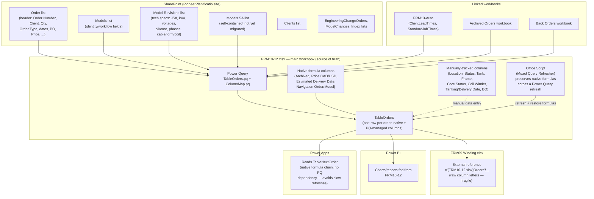

# Pioneer Transformer — Workflow & Data Infrastructure Overview

**Status:** living document. Started 2026-08-12 to capture the current state of the
Excel/SharePoint/Power Platform system before the next migration step: **retiring every
manually-typed and calculated column on `TableOrders`**, distributing each one to whichever
list actually owns that data (see [Planned: retiring FRM10-12's remaining
columns](#planned-retiring-frm10-12s-remaining-columns)). Update it as pieces move.

## Current state

Pioneer Transformer's planning/production data currently lives across two Excel workbooks
and a growing set of SharePoint lists, wired together with Power Query. Two things happen at
once during a "migration": data that used to live only as native Excel columns moves into a
SharePoint list, and Power Query is updated to pull it back into the workbook so existing
sheets/formulas keep working without staff having to change how they work day to day.

**Key characteristics of the current system:**

- **FRM10-12 is still the source of truth**, even for data that already has a SharePoint
  list — Power Query pulls SharePoint data *into* the workbook rather than the workbook
  reading live from SharePoint at use-time. A refresh is required to see SharePoint changes
  reflected in Excel.
- **Two kinds of non-Power-Query columns coexist on `TableOrders`**: native Excel formulas
  (computed, e.g. `Estimated Delivery Date`) and manually-typed production-tracking fields
  (Location, Status, Tank, Frame, Core Status, Coil Winder, Tanking/Delivery Date, BO). A
  plain "Refresh All" wipes the formula columns — only the dedicated Office Script preserves
  them. The manually-typed columns aren't touched by refresh but also aren't backed by
  anything outside the workbook, so they only exist wherever the workbook itself is.
- **`ColumnMap.pq`** is the single place that maps SharePoint field names/types onto the
  workbook's field names — new SharePoint-backed entities should be added there, not
  hardcoded into `TableOrders.pq`.
- **FRM09 depends on FRM10-12's `Orders` sheet by raw external-reference column letters**,
  which is why it breaks every time FRM10-12 inserts a column (see FRM09's own `CLAUDE.md`)
  — a structural fragility this infrastructure work should eventually design away from, not
  just patch each time.
- **Power Apps deliberately avoids the Power Query refresh dependency** for at least one flow
  (`TableNextOrder`) by reading a native-formula cell instead — a precedent worth reusing:
  anything that needs a fast, synchronous read probably shouldn't wait on a full workbook
  refresh.

## Planned: retiring FRM10-12's remaining columns

**Goal (user-stated, 2026-08-12):** nothing should be manually typed into `FRM10-12.xlsx`
anymore, and calculated/native-formula columns should also live somewhere else if possible.
Every column that isn't already SharePoint-backed needs a home — but not all in one new
list. Each one goes wherever its data actually *belongs* conceptually (a specific unit, an
order, a model, a client), which may be the new **Order Items** list, an existing list
gaining a new column, or — for calculated columns — no stored-data home at all, just
recomputed wherever it's needed.

**Full column audit**, pulled directly from the staging copy's `TableOrders` table
(`xl/tables/table1.xml` + a sample data row in `xl/worksheets/sheet1.xml`) — 83 columns total,
confirmed live-adjacent data, not reconstructed from memory:

### Already SharePoint-backed (34 columns, no action needed)
- **Via `Order` list** (14): `Order` (computed unit ID, e.g. `21408-1/1`), Client, PO, Order
  Date, Lead Time (from `ClientLeadTimes`), Ing. Due Date (computed), Qty, PO Item # (merge
  key), Province/State, WET-WETP, Indexing, Initial Promised Date, BO (from `BackOrders`
  linked workbook), Price Value.
- **Via `Models`/`Model Revisions`** (20): KVA and KV, Primary Voltage, Secondary Voltage,
  Phases, JS #, Description, Type, Info+, Protector & Switchgear Item #, Technical Notes,
  Core, Oil Type, **Oil Amount**, Configuration, Section Qty, Cable, Form, Copper (LV), Wire
  (HV), Overcoil.

### Native Excel calculated columns (7) — not data, don't need a "home" so much as a new place to *compute*
`Price`, `Estimated Delivery Date`, `Price CAD`, `Price USD`, `Navigation Order`,
`Navigation Model`, `Archived`. These are formulas over other columns, not source data — the
question per column is where the computation should live once the inputs are elsewhere
(a SharePoint calculated column, a Power Automate flow, a Power BI measure, or a Power Apps
formula), not "which list stores this value." `Navigation Order`/`Navigation Model` in
particular may not need to exist at all if the eventual UI is a SharePoint list view with
its own native navigation instead of a hyperlink column.

### Remaining 42 manually-typed columns — proposed destination (⚠ = needs your confirmation, not a domain call I can make from the data alone)

**→ New `Order Items` list** (varies per physical unit, confident these are unit-level):
Location, Status, Core Status, Production Line, Time (days), Tank, Tank Delivery Date,
Frame, ISO Stack, ISO Coil, Lead Assembly, Coiling Date, Stacking Date, Assembly Date,
Drying Date, Tanking Date, Testing Date, Finishing Date, Delivery Date, Original Tanking
Date, Tanking date change justification, Manual Estimated Delivery Date, Witness/Other,
Temperature Rise, Impulse, Partial D, Oil Analysis, **Protector Status** (confirmed
2026-08-12: per-unit, not per-order), **DB, SFRA, CSA** (confirmed 2026-08-12: per-unit test
results, same list as the other tests — not a separate list).

**`Trimestrial Customer`** — also goes on `Order Items`, per-unit, but flagged 2026-08-12 as
a deliberately provisional placement, not a confirmed fact about the data's real grain: it's
NOT a per-client attribute despite the name (same client can show different statuses across
their orders), but whether it truly needs to vary *within* a single multi-unit order (unit
1 different from unit 2 of the same order) vs. just order-to-order is still unconfirmed.
**User's call: start per-unit, revisit once there's enough real usage data to run a
proper table/workflow-optimization analysis** — if that analysis shows it's actually
order-level, descope it down to the `Order` list then rather than guessing now.

`Winder` and `Coil Winder` also both belong here, per-unit — confirmed 2026-08-12 they're
genuinely two different things, not a duplicate: `Winder` is the *set of possible* winders a
given unit could be produced on (an eligibility/capacity constraint), and `Coil Winder` is
the *specific* winder actually chosen for that unit. **Both should stay manually-filled
fields on Order Items, not computed/automated** — user feedback from staff is that they
prefer entering this by hand rather than having it derived, so keep it a plain editable
field in the new list, same as it is today, just off `TableOrders`.

**→ Existing `Order` list, as new columns** (one value per Order Number, not per unit —
sales/engineering-process fields, matching the workflow booleans `Order` already has like
"Receive CRM Sales Order"): Engineering Required, LDs, Client Date Status, Sales Notes,
Protector & Switchgear PO.

**→ Existing `Models`/`Model Revisions`, as new columns**:
- `Duplicate Order` — confirmed 2026-08-12 by user: genuinely model-level, it's "the last
  order that was produced/designed of that model," i.e. a pointer to the most recent Order
  Number built against this model, not an order-administrative field.
- `Duplicate` itself (the old Y/N "this design needs minimal new engineering" flag) is **not
  migrated as-is** — confirmed 2026-08-12: it's an old classification being superseded by the
  **engineering modification tracker** (the existing `EngineeringChangeOrders`/`ModelChanges`
  SharePoint lists) — whatever the new list-based workflow needs from "was this a duplicate
  build" should be derived from that tracker going forward, not carried over as its own field.
- `Family` — confirmed 2026-08-12: model-level product-family/category classification code
  (e.g. custom vs. standard design), belongs on Models/Model Revisions.

### Open questions on mechanics (separate from *which* column goes *where*)
1. ~~Edit surface / sync direction~~ — **resolved 2026-08-12**: staff will edit `Order Items`
   rows directly in a SharePoint list view, same as `Order`/`Models` today. SharePoint is the
   source of truth for this data; Power Query stays one-way (SharePoint → Excel), same
   differential-update pattern `ColumnMap.pq`/`TableOrders.pq` already use — **no
   bidirectional write-back mechanism needed**, this fits the existing pattern exactly.
2. Calculated columns (`Price`, `Estimated Delivery Date`, `Price CAD/USD`,
   `Archived`) — **decided 2026-08-12: parallel-run, then cut over.** Keep these as native
   Excel formulas on `TableOrders` for now (still reading from what are now SharePoint-backed
   lookup columns). In parallel, try building the same logic as SharePoint calculated
   columns (on `Order`/`Order Items`, once their inputs live there). Only remove the Excel
   formulas once SharePoint's version is confirmed to reproduce every one of them correctly —
   don't cut over on a single field passing, validate the whole set first. If SharePoint's
   formula language can't express one (e.g. the currency-conversion `XLOOKUP` against
   `Table_USD_CAD_Conversion_Rate` behind Price CAD/USD, or multi-step `IF` chains like
   `Estimated Delivery Date`), that one likely needs a Power Automate flow instead — decide
   per-column once the parallel-run surfaces which ones SharePoint genuinely can't handle.

## Order Items list schema (draft v1)

Types below are inferred from the sample row pulled during the column audit (a single row
isn't enough to be certain, especially for anything currently blank) — flagged with ⚠ where
the type is a real guess, not just a formality. Not yet built in SharePoint.

**Identity / merge key:**

| Field | Type | Notes |
|---|---|---|
| Title | Text | Set to the unit identifier, e.g. `21408-1/1` — same value `TableOrders.pq` already computes as its `Order` column, so this doubles as the natural join key for the eventual Power Query merge (same pattern `ArchivedOrders`/`BackOrders` already use, keyed on `Order`). |
| Order Number | Lookup → `Order` list | The merge key back to the order header, e.g. `21408`. |
| Unit # | Number | The numerator in the unit identifier (`1` in `21408-1/1`) — stored explicitly rather than parsed out of Title every time it's needed. |
| Qty | Number | The denominator (`1` in `21408-1/1`) — for convenience/sanity-checking only; `Order` list's `Qty` stays authoritative. |
| SA Job | Yes/No | Matches `TableOrders.pq`'s existing computed `SA Job` boolean. |

**Test/QA results** (⚠ currently stored as a text marker — `'x'` for done/pass, blank otherwise; proposing Yes/No instead, which is a real type change worth confirming, not just a formality):

| Field | Type |
|---|---|
| Witness/Other | Text |
| Temperature Rise | Yes/No (confirmed 2026-08-12) |
| Impulse | Yes/No (confirmed 2026-08-12) |
| Partial D | Yes/No (confirmed 2026-08-12) |
| Oil Analysis | Yes/No (confirmed 2026-08-12) |
| DB | Yes/No (confirmed 2026-08-12) |
| SFRA | Yes/No (confirmed 2026-08-12) |
| CSA | Yes/No (confirmed 2026-08-12) |
| Protector Status | Choice: Entrepôt SN, Reçu, à vérifier (real values found 2026-08-12, from `TableValidationProtectorStatus` on the workbook's `List` sheet) |

**Production tracking:**

| Field | Type | Notes |
|---|---|---|
| Location | Choice: Isolation (IS), Bobinage (BO), Stacking (ST), Assemblage (AS), Four (FO), Tanking (TA), Test (TE), Finition (FI), Livraison (LI), Entrepôt (ENT), Extérieur (XT), Réparation (RE) | Confirmed 2026-08-12 from `TableValidationLocationCodes`. **Purely the physical production stage now** — `AN` (Annulée/cancelled) is deliberately dropped from this list, moved to the new `Item Status` field below (2026-08-12 design decision: don't overload "where is it" with "what happened to it"). |
| Item Status | Choice: Active, Delivered, Cancelled, Regrouped | **New field, added 2026-08-12.** Carries the lifecycle state that used to be smuggled into `Location` (`AN`) or inferred from `Location`+`Delivery Date` (the old completion heuristic). Defaults to `Active`; flips to `Delivered`/`Cancelled`/`Regrouped` as those events happen. See [completion/cancellation/archiving](#planned-completion-cancellation-and-archiving-logic) below for how each state gets set. |
| Status | Text | Confirmed 2026-08-12: this is a **composite** value — a validated Prefix (Attente/AT, En cours/EC, Réparation/RE, Manque Pièces/BO, Terminé/TE, Bobine 1/B1, Bobine 2/B2, Bobine 3/B3, from `TableValidationStatusCode`) concatenated with a month-year suffix (sample: `TE-Jui-16`). Kept as plain Text for now rather than guessing how to split it — worth deciding later whether this becomes two fields (a Choice for the prefix + a separate date) or stays one text value. |
| Core Status | Choice: Entrepôt SN, Reçu, Transport | Confirmed 2026-08-12 from `TableValidationCoreStatus`. |
| Production Line | Choice: Power / Ligne 1, Distribution, Power, Zone B, Ligne 1 | Confirmed 2026-08-12 from `TableValidationProductionLine`. |
| Time (days) | Number | |
| Tank | Text ⚠ | Sample value `R` — no matching validation list found. **Working hypothesis (2026-08-12, unconfirmed): `R` = "Received."** User needs to check with the team before this is locked in — don't build a Choice list off this guess yet. |
| Frame | Choice: Plaspak, Reçu | **Corrected 2026-08-12** — earlier guessed this was a numeric identifier from the sample (`0`), but the real validation list (`Table20`/`Frame`) shows it's a status Choice field instead. |
| ISO Stack | Text ⚠ | Same unconfirmed value/hypothesis as `Tank` (sample: `R`, guessed "Received," not yet confirmed). |
| ISO Coil | Text ⚠ | Same unconfirmed value/hypothesis as `Tank` (sample: `R`, guessed "Received," not yet confirmed). |
| Lead Assembly | Text ⚠ | Same unconfirmed value/hypothesis as `Tank` (sample: `R`, guessed "Received," not yet confirmed). |
| Winder | Text | Must stay Text (not Number) — values mix plain IDs and ranges (`100-104`) in the sample. Per user, stays manually-filled, not derived. |
| Coil Winder | Text | Same as `Winder` — kept Text even though the sample looked numeric, for consistency and to avoid a type mismatch if another row uses a non-numeric ID. Manually-filled. |
| Trimestrial Customer | Text ⚠ | Blank in the sampled rows — type genuinely unconfirmed; provisional per-unit placement (see above), revisit together with the placement question. |

**Dates:**

| Field | Type |
|---|---|
| Tank Delivery Date | Date |
| Coiling Date | Date |
| Stacking Date | Date |
| Assembly Date | Date |
| Drying Date | Date |
| Tanking Date | Date |
| Testing Date | Date |
| Finishing Date | Date |
| Delivery Date | Date |
| Original Tanking Date | Date |
| Manual Estimated Delivery Date | Date |
| Tanking date change justification | Multi-line text (Note) — sample value was a long `/`-delimited log of past change reasons. |

## Planned: completion, cancellation, and archiving logic

Noted 2026-08-12 by user, not yet built — logged here so it isn't lost before the "complete
task workflow" project formalizes it.

**Design decision (2026-08-12): don't overload `Location` with lifecycle events.** The old
Excel workflow packed cancellation (`AN`) and — historically — regrouping (`GR`, added ~1
year ago, since untraceable even by the user: *"I am not sure where the GR went"*) into the
same `Location` dropdown that otherwise describes physical production stages (Isolation,
Bobinage, Tanking, ...). That mixing is exactly why `GR` became unrecoverable — a lifecycle
event living inside a "where is it physically" field has no home of its own to audit. Fixed
in the new schema by splitting into two fields on `Order Items` (see schema table above):
- **`Location`** — physical production stage only (12 values, `AN` removed).
- **`Item Status`** — the lifecycle state: `Active` (default), `Delivered`, `Cancelled`,
  `Regrouped`.

**How each `Item Status` value gets set:**
- **`Delivered`**: replaces the old two-field heuristic (`Delivery Date` populated AND
  `Location = LI`) with a single authoritative value. Still likely *driven by* `Delivery
  Date` being populated (e.g. a calculated column or flow sets it automatically) rather than
  requiring a second manual entry — mechanism not yet decided.
- **`Cancelled`**: manual, replaces the old `AN` `Location` value.
- **`Regrouped`**: manual, replaces the old `GR` `Location` value. Per the note below, this
  status alone doesn't capture the *relationship* — what the unit turned into — so it likely
  needs to pair with a reference field, not stand alone.
- **`Active`**: default, everything still in normal production flow.

**Still open:**
- `Regrouped` is a relationship, not just a status — recording "this unit was regrouped"
  flags *that* it happened but not *what it became* or *what it merged with*. If that
  history needs to be queryable later (e.g. "what did order X's units turn into"), `Order
  Items` likely needs a reference/lookup field pointing at the resulting item(s), not just
  the status value.
- Cancellation logic needed at both levels: a whole `Order` can be cancelled, but so can one
  unit within a multi-unit order while the rest proceed — so `Order` likely needs its own
  equivalent status, not just `Order Items`.
- **Archiving for Power BI historical analysis**: orders need an archiving mechanism that
  keeps them usable for historical reporting once removed from the live working set. User is
  considering switching the existing archive Power Query (`ArchivedOrders`/the "Archived
  Orders workbook" in the current-state diagram above) to pull from SharePoint instead of
  FRM10-12 — consistent with the rest of this migration's direction (SharePoint as the
  source, Excel/Power BI as consumers).

## Next steps
- [ ] Confirm the draft schema above (especially the ⚠-flagged type changes) with the user,
      then build the `Order Items` list in SharePoint and add the confirmed new columns to
      `Order`/`Models`/`Model Revisions`.
- [ ] Add `Order Items` (and any newly-added columns on existing lists) to `ColumnMap.pq`'s
      entity list, extending `TableOrders.pq` the same way `Model Revisions` was added.
- [ ] Build SharePoint calculated-column equivalents of the 7 native formulas in parallel
      with the existing Excel formulas; only remove the Excel versions once every one is
      confirmed to match. Any that SharePoint's formula language can't express become a
      Power Automate flow instead.
- [ ] Decide the mechanism that sets `Item Status = Delivered` (calculated from `Delivery
      Date`, a flow, or still manual) once `Order Items` exists to test against.
- [ ] Design the reference/lookup field that records what a `Regrouped` item actually turned
      into — `Item Status = Regrouped` alone only flags that it happened, not the relationship.
- [ ] Design the equivalent cancellation representation on `Order` (not just `Order Items`) —
      a whole order can be cancelled, not just one unit within it.
- [ ] Design the archiving mechanism (SharePoint-sourced, Power BI-consumable) — decide
      whether to repoint the existing `ArchivedOrders` Power Query at SharePoint instead of
      FRM10-12.
- [ ] Revisit FRM09's raw-column-letter fragility (see FRM09's `CLAUDE.md`) as a candidate
      for the same structured-reference treatment once `Order Items` exists.
- [ ] **Future review point (user's call, 2026-08-12):** once `Order Items` and the other
      new/changed lists have real usage history, run a proper data/workflow-optimization
      analysis rather than deciding placement from guesses now. `Trimestrial Customer`
      (currently per-unit, provisionally) is the first known candidate to revisit, but treat
      this as a general standing check — any field placed on a hunch during this initial
      migration is a candidate for descoping once actual usage patterns are visible.
